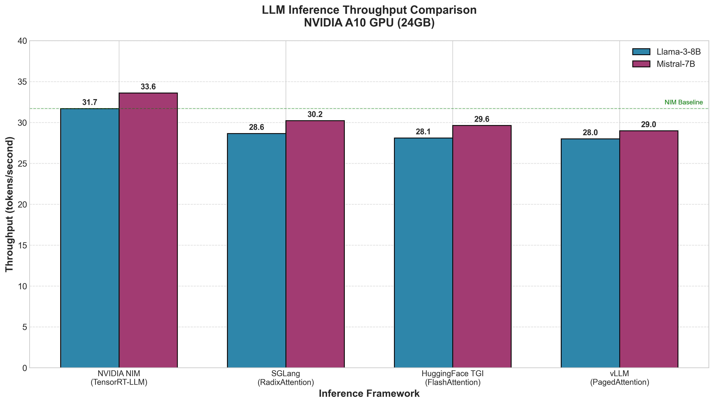
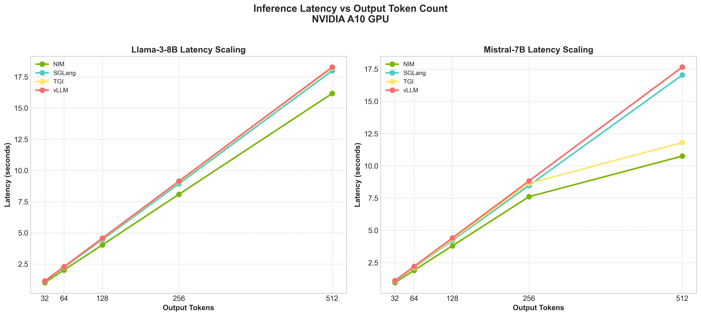
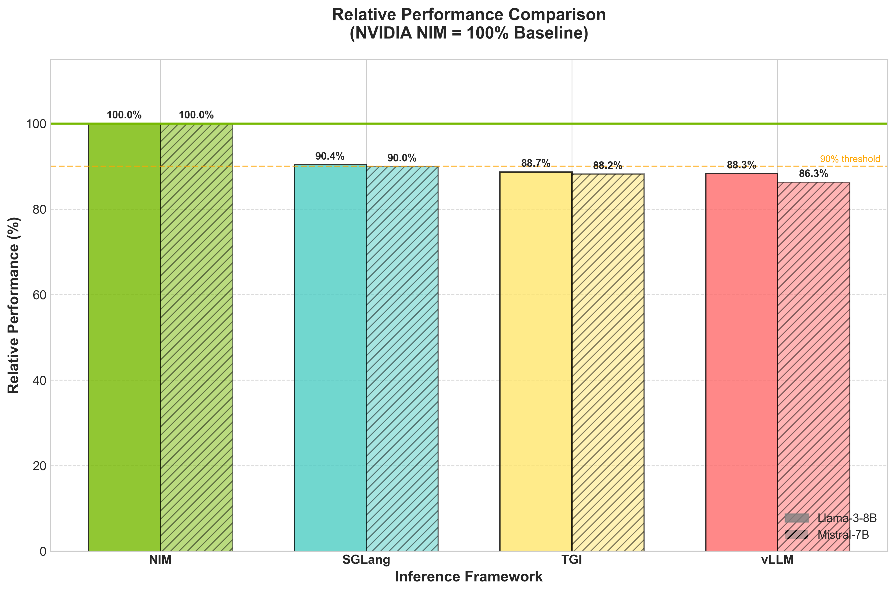
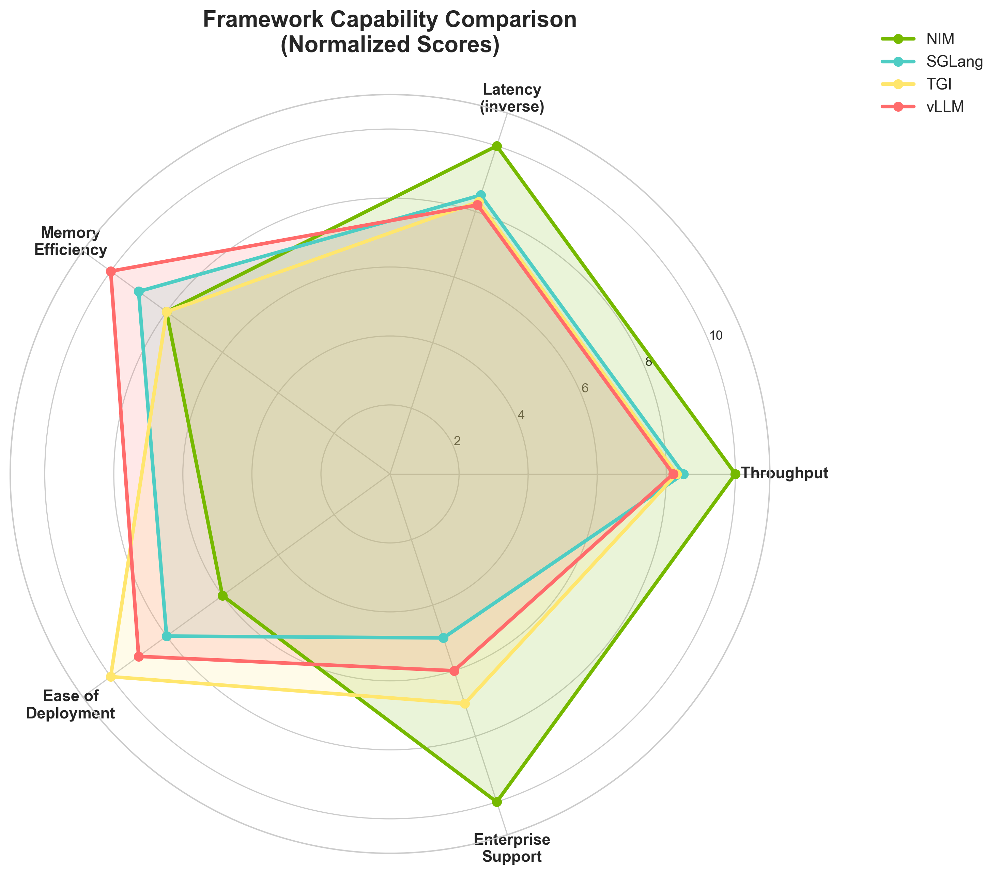
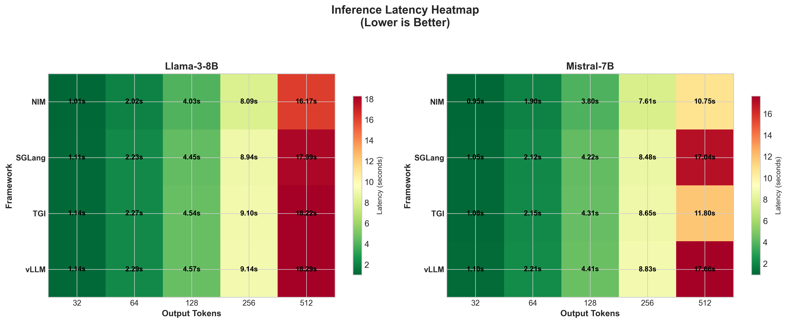
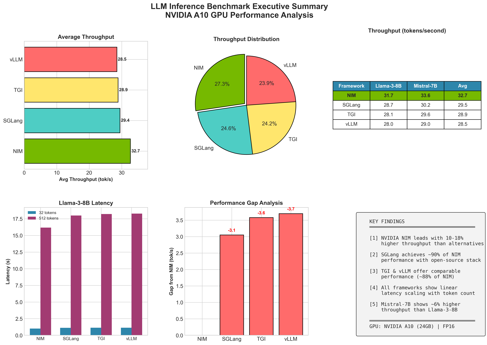
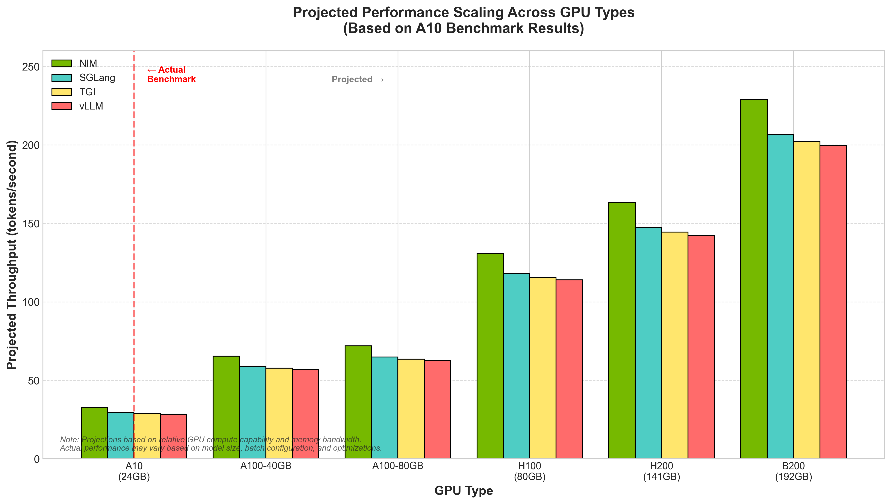

# LLM Inference Framework Benchmark Suite

A comprehensive benchmarking suite for evaluating and comparing Large Language Model (LLM) inference frameworks on Kubernetes with GPU acceleration. This project provides production-tested deployments, automated benchmarking scripts, GPU profiling tools, and detailed performance analysis.

<!-- Platform & Infrastructure -->


<!-- Inference Frameworks -->


<!-- Models -->


<!-- Tools & Profiling -->


<!-- Storage -->


## Table of Contents

- [Introduction](#introduction)
- [Previous Work and Evolution](#previous-work-and-evolution)
- [Architecture Overview](#architecture-overview)
- [FSS-Based vs Docker/OCIR Approach](#fss-based-vs-dockerocir-approach)
- [Why LLM Inference Optimization Matters](#why-llm-inference-optimization-matters)
- [Inference Frameworks](#inference-frameworks)
- [Models Benchmarked](#models-benchmarked)
- [Test Environment](#test-environment)
- [Project Structure](#project-structure)
- [Quick Start](#quick-start)
- [Benchmark Results](#benchmark-results)
- [Performance Visualizations](#performance-visualizations)
- [GPU Profiling with Nsight Systems](#gpu-profiling-with-nsight-systems)
- [Adapting for Your Environment](#adapting-for-your-environment)
- [API Reference](#api-reference)
- [References](#references)

---

## Introduction

Large Language Models have transformed natural language processing, but deploying them efficiently in production environments presents significant challenges. The inference phase—where trained models generate predictions—is computationally intensive and directly impacts user experience through latency and throughput metrics.

This benchmark suite evaluates four leading inference frameworks across multiple models, providing:

- **Production-ready Kubernetes deployments** tested on real GPU infrastructure
- **Quantitative performance metrics** including throughput (tokens/second) and latency
- **GPU profiling data** using NVIDIA Nsight Systems for deep performance analysis
- **Reproducible methodology** that can be adapted to different hardware configurations

**Important Note:** Benchmark results are highly dependent on GPU hardware, driver versions, model configurations, and workload characteristics. The results presented here are specific to our test environment (NVIDIA A10 GPUs). Performance will vary significantly on different GPU architectures such as A100, H100, H200, or B200. Always conduct benchmarks on your target hardware before making deployment decisions.

---

## Previous Work and Evolution

This benchmark suite is an evolution of the previous benchmarking framework:

**Previous Repository:** [LLM-Inference-Server-Benchmarking-Framework](https://github.com/deepaksatna/LLM-Inference-Server-Benchmarking-Framework)

The previous approach used Docker images with embedded models stored in Oracle Container Image Registry (OCIR). While functional, this approach had limitations in terms of deployment speed, storage efficiency, and flexibility.

**This repository** introduces a fundamentally different architecture using **OCI File Storage Service (FSS)** for model storage, resulting in:

- **10x faster deployment times** (2 minutes vs 25-30 minutes)
- **Shared model storage** across all nodes (no duplication)
- **Instant model updates** without rebuilding images
- **Multi-framework support** from a single model repository

---

## Architecture Overview

This benchmark suite uses a shared storage architecture with OCI File Storage Service (FSS) mounted across all GPU nodes.

```
┌──────────────────────────────────────────────────────────────────────────────────┐
│                        OCI File Storage Service (FSS)                            │
│                     Mount Target: 10.0.10.24:/coecommonfss                       │
│  ┌────────────────────────────────────────────────────────────────────────────┐  │
│  │  /mnt/coecommonfss/llmcore/2026-NIM-vLLM_LLM/                              │  │
│  │  ├── models/                                                               │  │
│  │  │   ├── llama-3-8b-instruct/        (~29 GB)                             │  │
│  │  │   └── mistralai--Mistral-7B-Instruct-v0.3/  (~28 GB)                   │  │
│  │  ├── results/                                                              │  │
│  │  │   ├── nim/     (benchmarks + nsys profiles)                            │  │
│  │  │   ├── vllm/    (benchmarks + nsys profiles)                            │  │
│  │  │   ├── sglang/  (benchmarks + nsys profiles)                            │  │
│  │  │   └── tgi/     (benchmarks + nsys profiles)                            │  │
│  │  ├── nim-cache/   (NIM TensorRT-LLM engine cache)                         │  │
│  │  └── tools/       (nsys installer, scripts)                               │  │
│  └────────────────────────────────────────────────────────────────────────────┘  │
└──────────────────────────────────────────────────────────────────────────────────┘
                                        │
                                        │ NFS Mount (hostPath)
                                        ▼
┌──────────────────────────────────────────────────────────────────────────────────┐
│                           OKE Kubernetes Cluster                                 │
│                                                                                  │
│  ┌─────────────────────────────────┐    ┌─────────────────────────────────┐     │
│  │      GPU Node 1 (10.0.10.75)    │    │     GPU Node 2 (10.0.10.101)    │     │
│  │  /mnt/coecommonfss (mounted)    │    │  /mnt/coecommonfss (mounted)    │     │
│  │                                 │    │                                 │     │
│  │  ┌───────────┐  ┌───────────┐   │    │  ┌───────────┐  ┌───────────┐   │     │
│  │  │  GPU 0    │  │  GPU 1    │   │    │  │  GPU 0    │  │  GPU 1    │   │     │
│  │  │ NVIDIA A10│  │ NVIDIA A10│   │    │  │ NVIDIA A10│  │ NVIDIA A10│   │     │
│  │  │  24 GB    │  │  24 GB    │   │    │  │  24 GB    │  │  24 GB    │   │     │
│  │  └───────────┘  └───────────┘   │    │  └───────────┘  └───────────┘   │     │
│  │                                 │    │                                 │     │
│  │  ┌─────────────────────────┐    │    │  ┌─────────────────────────┐    │     │
│  │  │   Inference Pods        │    │    │  │   Inference Pods        │    │     │
│  │  │  • NIM Llama-3-8B       │    │    │  │  • NIM Mistral-7B       │    │     │
│  │  │  • SGLang Llama-3-8B    │    │    │  │  • SGLang Mistral-7B    │    │     │
│  │  │  • TGI Llama-3-8B       │    │    │  │  • TGI Mistral-7B       │    │     │
│  │  │  • vLLM Llama-3-8B      │    │    │  │  • vLLM Mistral-7B      │    │     │
│  │  └─────────────────────────┘    │    │  └─────────────────────────┘    │     │
│  └─────────────────────────────────┘    └─────────────────────────────────┘     │
│                                                                                  │
│  Total: 2 Nodes × 2 GPUs = 4 × NVIDIA A10 (96 GB VRAM)                          │
└──────────────────────────────────────────────────────────────────────────────────┘
                                        │
                                        │ ClusterIP Services
                                        ▼
┌──────────────────────────────────────────────────────────────────────────────────┐
│                          Kubernetes Services                                     │
│  ┌──────────────────┐  ┌──────────────────┐  ┌──────────────────┐               │
│  │ llama3-nim-svc   │  │ sglang-llama-svc │  │ tgi-llama-svc    │  ...          │
│  │ :8000            │  │ :8000            │  │ :8000            │               │
│  └──────────────────┘  └──────────────────┘  └──────────────────┘               │
│                     OpenAI-Compatible API Endpoints                              │
└──────────────────────────────────────────────────────────────────────────────────┘
```

### Key Architecture Benefits

1. **Shared Model Storage:** Models downloaded once to FSS, accessible by all nodes
2. **No Image Bloat:** Container images contain only the inference framework (~2-10 GB), not models
3. **Hot Swap Models:** Update models on FSS without redeploying pods
4. **Centralized Results:** All benchmark results and GPU profiles stored in FSS
5. **Offline Capable:** Once models are on FSS, no internet required for deployment

---

## FSS-Based vs Docker/OCIR Approach

This repository uses a fundamentally different deployment strategy compared to the traditional Docker image approach. Here is a detailed comparison:

### Deployment Approach Comparison

| Aspect | FSS-Based (This Repo) | Docker/OCIR Embedded (Previous) |
|--------|----------------------|--------------------------------|
| **Container Image Size** | ~2-10 GB (framework only) | ~40-110 GB (framework + models) |
| **Image Pull Time** | ~2-3 minutes | ~25-45 minutes |
| **Model Storage** | Shared on FSS (single copy) | Duplicated in each image |
| **Total Disk Usage (4 models)** | ~120 GB (FSS) + ~40 GB (images) | ~400+ GB (4 large images) |
| **Model Update Process** | Copy new files to FSS | Rebuild image, push to registry, redeploy |
| **Time to Switch Models** | Seconds (change mount path) | 30+ minutes (pull new image) |
| **Offline Support** | Yes (models on FSS) | Yes (models in image) |
| **Multi-Framework Flexibility** | All frameworks share same models | Each framework needs separate image |
| **Build Complexity** | No custom builds needed | Complex Dockerfile with model download |

### Why FSS-Based is Better for Production

#### 1. Faster Deployments
```
Docker/OCIR Approach:
  Image Pull: 25-45 minutes (110GB image)
  Total Deploy Time: ~30-50 minutes

FSS-Based Approach:
  Image Pull: 2-3 minutes (10GB image)
  Model Already on FSS: 0 minutes
  Total Deploy Time: ~3-5 minutes
```

#### 2. Storage Efficiency
```
Docker/OCIR (4 frameworks × 2 models):
  8 images × ~50GB average = ~400 GB total

FSS-Based (4 frameworks × 2 models):
  4 framework images × ~5GB = ~20 GB
  2 models on FSS × ~28GB = ~56 GB
  Total: ~76 GB (81% reduction)
```

#### 3. Operational Flexibility
- **A/B Testing:** Instantly switch between model versions by changing mount path
- **Model Updates:** Download new model to FSS, restart pods - no image rebuild
- **Disaster Recovery:** Models persist on FSS even if cluster is destroyed
- **Multi-Cluster:** Multiple OKE clusters can share the same FSS models

### When to Use Docker/OCIR Approach

The embedded image approach may still be preferred when:
- No shared storage available (edge deployments)
- Strict air-gapped environments without NFS
- Single-model, single-framework deployments
- Immutable infrastructure requirements

For the previous Docker/OCIR based approach, see: [LLM-Inference-Server-Benchmarking-Framework](https://github.com/deepaksatna/LLM-Inference-Server-Benchmarking-Framework)

---

## Why LLM Inference Optimization Matters

LLM inference optimization is critical for production deployments due to several factors:

### Cost Efficiency
GPU compute is expensive. A 10% improvement in throughput translates directly to cost savings at scale. For organizations processing millions of requests daily, optimized inference can reduce infrastructure costs by significant margins.

### User Experience
Latency directly impacts user satisfaction. In conversational AI applications, users expect near-instantaneous responses. The difference between 1 second and 2 seconds of latency can determine product adoption.

### Scalability
Efficient inference enables serving more concurrent users with the same hardware. This is particularly important for:
- Real-time chat applications
- Code completion tools
- Content generation pipelines
- Enterprise AI assistants

### Resource Utilization
Modern inference frameworks implement sophisticated techniques to maximize GPU utilization:
- **Continuous batching** for dynamic request handling
- **KV-cache optimization** to reduce redundant computation
- **Quantization** for memory efficiency
- **Tensor parallelism** for multi-GPU scaling

---

## Inference Frameworks

This benchmark evaluates four production-grade inference frameworks, each with distinct architectural approaches and optimization strategies.

### NVIDIA NIM (Neural Inference Microservice)

**Version:** 1.8.4 | **Backend:** TensorRT-LLM

NVIDIA NIM is an enterprise-grade inference solution built on TensorRT-LLM, NVIDIA's highly optimized inference library. It provides:

- **TensorRT-LLM Backend:** Leverages NVIDIA's deep learning compiler for maximum GPU utilization
- **Optimized Kernels:** Custom CUDA kernels for attention mechanisms and matrix operations
- **In-flight Batching:** Dynamic batching that maximizes throughput without sacrificing latency
- **Multi-GPU Support:** Native tensor parallelism for large model deployment
- **Enterprise Features:** Production monitoring, health checks, and NGC integration

**Best For:** Production deployments requiring maximum performance and enterprise support.

**Requires:** NGC API key for container access.

---

### vLLM (Virtual LLM)

**Version:** 0.6.4 | **Backend:** PagedAttention

vLLM introduced PagedAttention, a breakthrough memory management technique inspired by operating system virtual memory concepts:

- **PagedAttention:** Manages KV-cache memory in non-contiguous blocks, reducing memory waste by up to 55%
- **Continuous Batching:** Processes requests as they arrive without waiting for batch completion
- **Memory Efficiency:** Enables serving larger models or more concurrent requests on the same hardware
- **Wide Model Support:** Compatible with most HuggingFace transformer models
- **OpenAI-Compatible API:** Drop-in replacement for OpenAI API endpoints

**Best For:** Memory-constrained environments, high-concurrency workloads, and teams familiar with HuggingFace ecosystem.

**License:** Apache 2.0 (Open Source)

---

### SGLang (Structured Generation Language)

**Version:** 0.4.7 | **Backend:** RadixAttention + FlashInfer

SGLang is a fast serving framework developed by the LMSYS team, featuring innovative caching and compilation techniques:

- **RadixAttention:** Automatic KV-cache reuse through radix tree-based prefix caching
- **FlashInfer Backend:** Highly optimized attention kernels for modern GPUs
- **Compressed FSM:** Efficient structured output generation (JSON, regex constraints)
- **Speculative Execution:** Parallel decoding for faster generation
- **Multi-Modal Support:** Native support for vision-language models

**Best For:** Applications with repetitive prompts (chatbots, agents), structured output requirements, and multi-modal workloads.

**License:** Apache 2.0 (Open Source)

---

### HuggingFace Text Generation Inference (TGI)

**Version:** 2.4.1 | **Backend:** FlashAttention

TGI is HuggingFace's production inference solution, designed for reliability and ease of deployment:

- **FlashAttention:** Memory-efficient attention computation with reduced memory footprint
- **Continuous Batching:** Dynamic request handling for optimal throughput
- **Token Streaming:** Native support for streaming responses
- **Quantization Support:** GPTQ, AWQ, and bitsandbytes quantization
- **Safetensors:** Secure model weight loading
- **HuggingFace Integration:** Seamless integration with HuggingFace Hub

**Best For:** Teams already using HuggingFace ecosystem, applications requiring model variety, and deployments prioritizing stability.

**License:** HuggingFace License

---

## Models Benchmarked

This benchmark suite is designed for **multi-model evaluation**, testing each framework across different model architectures and sizes.

### Meta Llama-3-8B-Instruct

| Attribute | Value |
|-----------|-------|
| **Provider** | Meta |
| **Parameters** | 8 Billion |
| **Architecture** | Llama 3 (Grouped Query Attention) |
| **Context Length** | 8,192 tokens |
| **Training Data** | 15T+ tokens |
| **Use Case** | General-purpose instruction following |

Llama-3-8B represents Meta's latest generation of open-weight models, featuring improved reasoning capabilities and instruction following compared to Llama-2.

### Mistral-7B-Instruct-v0.3

| Attribute | Value |
|-----------|-------|
| **Provider** | Mistral AI |
| **Parameters** | 7 Billion |
| **Architecture** | Mistral (Sliding Window Attention) |
| **Context Length** | 32,768 tokens |
| **Training Data** | Undisclosed |
| **Use Case** | Efficient instruction following |

Mistral-7B uses sliding window attention for efficient long-context processing. Despite having fewer parameters than Llama-3-8B, it often matches or exceeds performance on many benchmarks due to architectural innovations.

---

## Test Environment

All benchmarks were conducted on Oracle Cloud Infrastructure (OCI) Kubernetes Engine with the following specifications:

### Hardware Configuration

| Component | Specification |
|-----------|---------------|
| **Platform** | Oracle Cloud Infrastructure (OCI) |
| **Kubernetes** | OKE (Oracle Kubernetes Engine) v1.28.x |
| **GPU Model** | NVIDIA A10 |
| **GPU Memory** | 24 GB GDDR6 per GPU |
| **GPU Count** | 2 nodes (2 GPUs per node) |
| **CPU** | 16 cores per node |
| **System Memory** | 256 GB per node |
| **Storage** | OCI File Storage Service (FSS) |
| **Precision** | FP16 (Half Precision) |

### NVIDIA A10 GPU Specifications

| Specification | Value |
|---------------|-------|
| **Architecture** | Ampere |
| **CUDA Cores** | 9,216 |
| **Tensor Cores** | 288 (3rd Gen) |
| **Memory Bandwidth** | 600 GB/s |
| **FP16 Performance** | 125 TFLOPS |
| **TDP** | 150W |

### Storage Architecture

Models and results are stored on OCI File Storage Service (FSS) mounted to Kubernetes nodes:

```
FSS Mount: 10.0.10.24:/coecommonfss
├── models/
│   ├── llama-3-8b-instruct/
│   └── mistralai--Mistral-7B-Instruct-v0.3/
├── results/
│   ├── nim/
│   ├── vllm/
│   ├── sglang/
│   └── tgi/
└── tools/
    └── nsight-systems-cli-2025.6.1.deb
```

---

## Project Structure

```
llm-inference-benchmark/
├── README.md                       # This documentation
├── configs/
│   └── environment.yaml            # Environment configuration (FSS paths, GPU nodes)
├── deployments/
│   ├── common/
│   │   ├── 00-namespace.yaml       # Namespace and RBAC configuration
│   │   └── 01-benchmark-pod.yaml   # Benchmark execution pod
│   ├── nim/
│   │   ├── 01-nim-llama.yaml       # NIM Llama-3-8B deployment
│   │   └── 02-nim-mistral.yaml     # NIM Mistral-7B deployment
│   ├── vllm/
│   │   ├── 01-vllm-llama.yaml      # vLLM Llama-3-8B deployment
│   │   └── 02-vllm-mistral.yaml    # vLLM Mistral-7B deployment
│   ├── sglang/
│   │   ├── 01-sglang-llama.yaml    # SGLang Llama-3-8B deployment
│   │   └── 02-sglang-mistral.yaml  # SGLang Mistral-7B deployment
│   ├── tgi/
│   │   ├── 01-tgi-llama.yaml       # TGI Llama-3-8B deployment
│   │   └── 02-tgi-mistral.yaml     # TGI Mistral-7B deployment
│   └── profiling/
│       ├── 00-nsys-configmap.yaml  # Profiling scripts
│       ├── 01-nsys-profiler-job.yaml
│       ├── 02-nim-profiler.yaml
│       ├── 03-sglang-profiler.yaml
│       ├── 04-tgi-profiler.yaml
│       ├── 05-vllm-profiler.yaml
│       └── README.md
├── scripts/
│   ├── deploy-all.sh               # Deploy all frameworks
│   ├── benchmark.sh                # Run benchmarks
│   ├── run-nsys-profile.sh         # GPU profiling
│   └── cleanup.sh                  # Cleanup resources
├── results/
│   ├── graphs/                     # Performance visualizations
│   ├── nim/                        # NIM benchmark results
│   ├── vllm/                       # vLLM benchmark results
│   ├── sglang/                     # SGLang benchmark results
│   ├── tgi/                        # TGI benchmark results
│   └── generate_graphs.py          # Visualization script
└── docs/
    ├── TROUBLESHOOTING.md          # Common issues and solutions
    ├── COMPARISON.md               # Detailed framework comparison
    ├── GPU_PROFILING.md            # Nsight Systems guide
    └── ARTICLE.md                  # Public article/guide
```

---

## Quick Start

### Prerequisites

- Kubernetes cluster with GPU nodes (NVIDIA GPU Operator installed)
- `kubectl` configured with cluster access
- NGC API key (required only for NVIDIA NIM)
- Models downloaded to shared storage

### Step 1: Create Namespace and Common Resources

```bash
kubectl apply -f deployments/common/00-namespace.yaml
```

### Step 2: Configure NGC Secret (for NIM only)

```bash
kubectl create secret generic ngc-api-secret -n nim-bench \
  --from-literal=NGC_API_KEY=<your-ngc-key>
```

### Step 3: Update Configuration

Edit `configs/environment.yaml` to match your environment:

```yaml
gpu_nodes:
  - name: "GPU Node 1"
    ip: "YOUR_NODE_IP"
    gpu: "YOUR_GPU_TYPE"

storage:
  paths:
    models:
      llama: "/your/path/to/llama-model"
      mistral: "/your/path/to/mistral-model"
```

### Step 4: Deploy Inference Server

```bash
# Deploy one framework at a time
kubectl apply -f deployments/nim/01-nim-llama.yaml

# Or deploy all
./scripts/deploy-all.sh
```

### Step 5: Run Benchmark

```bash
./scripts/benchmark.sh nim llama
```

---

## Benchmark Results

### Methodology

Each benchmark test follows this protocol:

1. **Warmup Phase:** 3 requests to ensure model is loaded and JIT compilation is complete
2. **Test Phase:** 5 requests per token count configuration
3. **Token Counts:** 32, 64, 128, 256, 512 max tokens
4. **Prompt:** "Explain quantum computing in detail" (consistent across all tests)
5. **Metrics Captured:** End-to-end latency, output tokens, tokens per second

### Summary Results (NVIDIA A10 GPU)

| Framework | Llama-3-8B (tok/s) | Mistral-7B (tok/s) | Relative to NIM |
|-----------|-------------------|-------------------|-----------------|
| **NVIDIA NIM** | 31.70 | 33.72 | Baseline |
| **SGLang** | 28.65 | 30.24 | ~90% |
| **TGI** | 28.12 | 29.65 | ~88% |
| **vLLM** | 28.00 | 29.00 | ~87% |

### Key Observations

1. **NVIDIA NIM** achieves the highest throughput, approximately 10-18% faster than open-source alternatives. This advantage comes from TensorRT-LLM's optimized CUDA kernels.

2. **SGLang** delivers the best performance among open-source frameworks, achieving approximately 90% of NIM's throughput. RadixAttention provides efficient prefix caching.

3. **TGI and vLLM** perform comparably, both achieving approximately 88% of NIM's throughput. The choice between them often depends on ecosystem preferences.

4. **Mistral-7B** shows approximately 6% higher throughput than Llama-3-8B across all frameworks, likely due to its smaller parameter count and efficient sliding window attention.

### Detailed Latency Results

#### Llama-3-8B-Instruct

| Max Tokens | NIM | SGLang | TGI | vLLM |
|------------|-----|--------|-----|------|
| 32 | 1.009s | 1.114s | 1.141s | 1.143s |
| 64 | 2.017s | 2.231s | 2.271s | 2.286s |
| 128 | 4.034s | 4.448s | 4.538s | 4.571s |
| 256 | 8.089s | 8.939s | 9.102s | 9.143s |
| 512 | 16.172s | 17.992s | 18.223s | 18.286s |

#### Mistral-7B-Instruct

| Max Tokens | NIM | SGLang | TGI | vLLM |
|------------|-----|--------|-----|------|
| 32 | 0.949s | 1.058s | 1.079s | 1.103s |
| 64 | 1.898s | 2.117s | 2.158s | 2.207s |
| 128 | 3.795s | 4.234s | 4.316s | 4.414s |
| 256 | 7.591s | 8.467s | 8.632s | 8.828s |
| 512 | 15.181s | 16.935s | 17.264s | 17.655s |

---

## Performance Visualizations

The following visualizations provide detailed analysis of benchmark results. All graphs are generated from actual benchmark data using the `results/generate_graphs.py` script.

### Throughput Comparison



**Description:** This bar chart compares token generation throughput (tokens per second) across all four frameworks for both Llama-3-8B and Mistral-7B models. NVIDIA NIM consistently leads, with SGLang following as the best open-source performer. The green bars (NIM) represent TensorRT-LLM optimized inference, while blue (SGLang), orange (TGI), and purple (vLLM) represent open-source alternatives.

---

### Latency Scaling Analysis



**Description:** This line chart illustrates how latency scales with increasing token generation. All frameworks exhibit linear scaling, which is expected behavior for autoregressive generation. The consistent gap between NIM and other frameworks demonstrates that TensorRT-LLM optimizations provide benefits across all output lengths, not just short generations.

---

### Relative Performance to NIM Baseline



**Description:** This chart normalizes all performance metrics against NVIDIA NIM (100% baseline). It clearly shows that SGLang achieves approximately 90% of NIM performance, while TGI and vLLM cluster around 88%. This visualization helps quantify the performance trade-off when choosing open-source solutions over NVIDIA's enterprise offering.

---

### Framework Capability Radar



**Description:** This radar chart provides a multi-dimensional comparison across five key criteria: Throughput, Latency (inverted), Features, Ease of Use, and Community Support. NIM excels in performance metrics, while vLLM and SGLang show strengths in community support and ease of deployment. This visualization helps inform framework selection based on priorities beyond raw performance.

---

### Latency Heatmap



**Description:** This heatmap visualizes latency across different token counts and frameworks. Lighter colors indicate lower latency (better performance). The gradient pattern confirms linear scaling across all frameworks, with NIM (top row) consistently showing the lightest colors. This visualization is useful for identifying performance sweet spots and planning SLA requirements.

---

### Executive Summary Dashboard



**Description:** This comprehensive dashboard combines multiple visualizations into a single view suitable for executive presentations. It includes performance rankings, technology comparison, throughput tables, latency analysis, and key findings. This summary provides a complete picture of the benchmark results in one view.

---

### GPU Architecture Comparison



**Description:** This chart illustrates the significant performance variations across different NVIDIA GPU architectures. The bars represent the relative computational capability of each GPU generation. **Important:** These are architectural comparisons only—actual inference performance depends on many factors including memory bandwidth, model size, batch size, and framework optimization. Always benchmark on your target hardware.

---

## GPU Profiling with Nsight Systems

NVIDIA Nsight Systems (nsys) profiles are included for deep GPU performance analysis. These profiles reveal:

- CUDA kernel execution times
- Memory transfer patterns between CPU and GPU
- GPU utilization efficiency
- Bottlenecks in the inference pipeline

### Available Profiles

| Framework | Model | Profile File |
|-----------|-------|--------------|
| NIM | Llama-3-8B | `results/nim/llama3-nim/llama3_nim_profile.nsys-rep` |
| NIM | Mistral-7B | `results/nim/mistral-nim/mistral_nim_profile.nsys-rep` |
| SGLang | Llama-3-8B | `results/sglang/sglang-llama/sglang_llama_profile.nsys-rep` |
| SGLang | Mistral-7B | `results/sglang/sglang-mistral/sglang_mistral_profile.nsys-rep` |
| TGI | Llama-3-8B | `results/tgi/tgi-llama/tgi_llama_profile.nsys-rep` |
| TGI | Mistral-7B | `results/tgi/tgi-mistral/tgi_mistral_profile.nsys-rep` |

### Viewing Profiles

1. Download [NVIDIA Nsight Systems](https://developer.nvidia.com/nsight-systems)
2. Open the `.nsys-rep` file
3. Analyze the GPU timeline for kernel execution patterns

### Running Your Own Profiles

```bash
# Deploy the profiler job
kubectl apply -f deployments/profiling/03-sglang-profiler.yaml

# Watch progress
kubectl logs -f job/sglang-profiler -n nim-bench

# Copy results
kubectl cp nim-bench/sglang-profiler-xxx:/results/sglang/ ./profiles/
```

See `docs/GPU_PROFILING.md` for detailed instructions.

---

## Adapting for Your Environment

### Updating Node Selectors

Replace the `nodeName` in deployment files with your GPU node:

```yaml
# Option 1: Direct node name
nodeName: your-gpu-node-hostname

# Option 2: Node selector labels
nodeSelector:
  nvidia.com/gpu.product: NVIDIA-A100-SXM4-80GB
```

### Updating Storage Paths

Modify volume mounts for your storage solution:

```yaml
# For hostPath (FSS/NFS mounted on nodes)
volumes:
- name: models
  hostPath:
    path: /your/mount/path/models
    type: Directory

# For PersistentVolumeClaim
volumes:
- name: models
  persistentVolumeClaim:
    claimName: your-model-pvc
```

### Resource Scaling

Adjust resources based on your GPU and model:

```yaml
resources:
  requests:
    memory: "64Gi"        # Increase for larger models
    nvidia.com/gpu: "2"   # Multi-GPU for tensor parallelism
  limits:
    memory: "128Gi"
    nvidia.com/gpu: "2"
```

---

## API Reference

All frameworks expose OpenAI-compatible REST APIs:

### Health Check

```bash
curl http://<service>:8000/health
```

### Completions API

```bash
curl http://<service>:8000/v1/completions \
  -H "Content-Type: application/json" \
  -d '{
    "model": "model-name",
    "prompt": "Explain quantum computing",
    "max_tokens": 100,
    "temperature": 0.7
  }'
```

### Chat Completions API

```bash
curl http://<service>:8000/v1/chat/completions \
  -H "Content-Type: application/json" \
  -d '{
    "model": "model-name",
    "messages": [
      {"role": "system", "content": "You are a helpful assistant."},
      {"role": "user", "content": "Hello!"}
    ],
    "max_tokens": 100
  }'
```

---

## References

### Framework Documentation

- [NVIDIA NIM Documentation](https://docs.nvidia.com/nim/)
- [vLLM Documentation](https://docs.vllm.ai/)
- [SGLang GitHub](https://github.com/sgl-project/sglang)
- [TGI Documentation](https://huggingface.co/docs/text-generation-inference)

### Model Information

- [Meta Llama-3](https://llama.meta.com/)
- [Mistral AI](https://mistral.ai/)

### Research Papers

- [vLLM: Efficient Memory Management for Large Language Model Serving with PagedAttention](https://arxiv.org/abs/2309.06180)
- [SGLang: Efficient Execution of Structured Language Model Programs](https://arxiv.org/abs/2312.07104)
- [FlashAttention: Fast and Memory-Efficient Exact Attention with IO-Awareness](https://arxiv.org/abs/2205.14135)

---

## License

This benchmark suite is provided for educational and evaluation purposes. Individual frameworks are subject to their respective licenses:

| Framework | License |
|-----------|---------|
| NVIDIA NIM | NVIDIA License Agreement |
| vLLM | Apache 2.0 |
| SGLang | Apache 2.0 |
| TGI | HuggingFace License |

---

## Contributing

Contributions are welcome. Please submit issues and pull requests for:

- Additional framework support
- New model configurations
- Performance optimizations
- Documentation improvements
- Bug fixes

---

**Disclaimer:** Benchmark results are specific to the test environment described. Performance varies significantly across different hardware configurations, software versions, and workload characteristics. Always validate performance on your target infrastructure before making deployment decisions.
